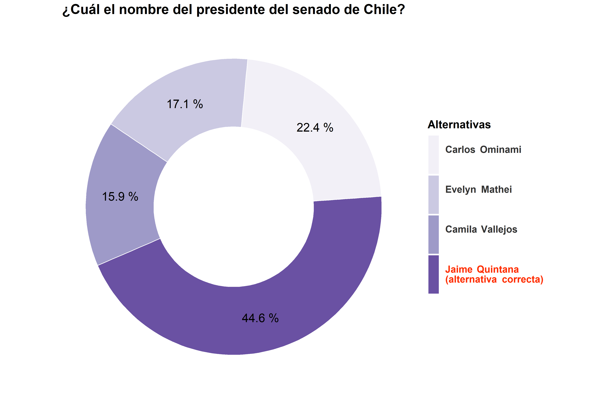
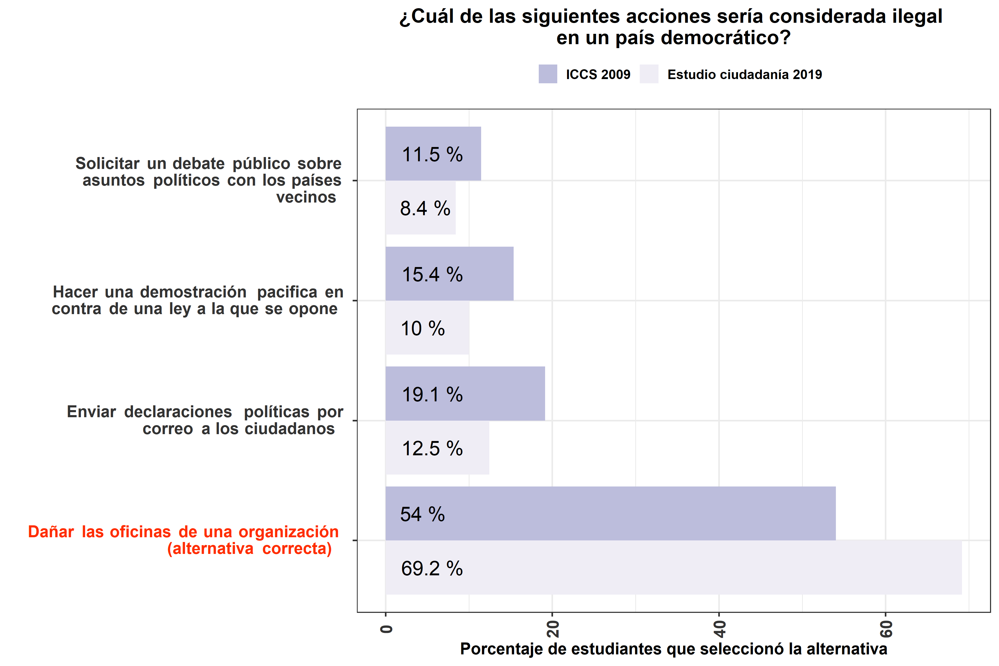
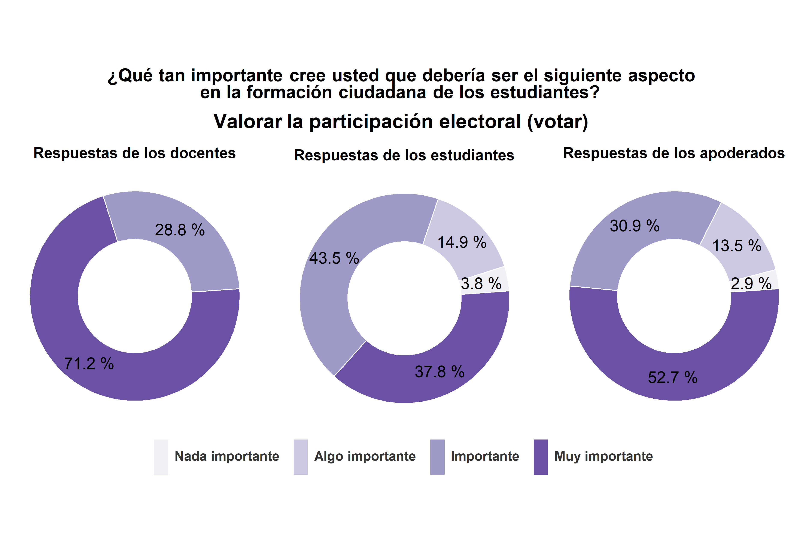
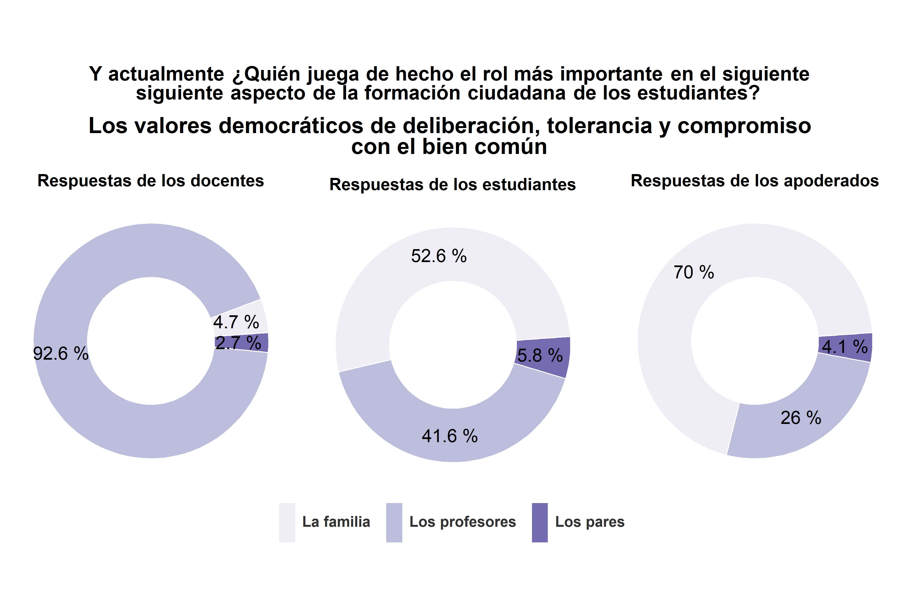
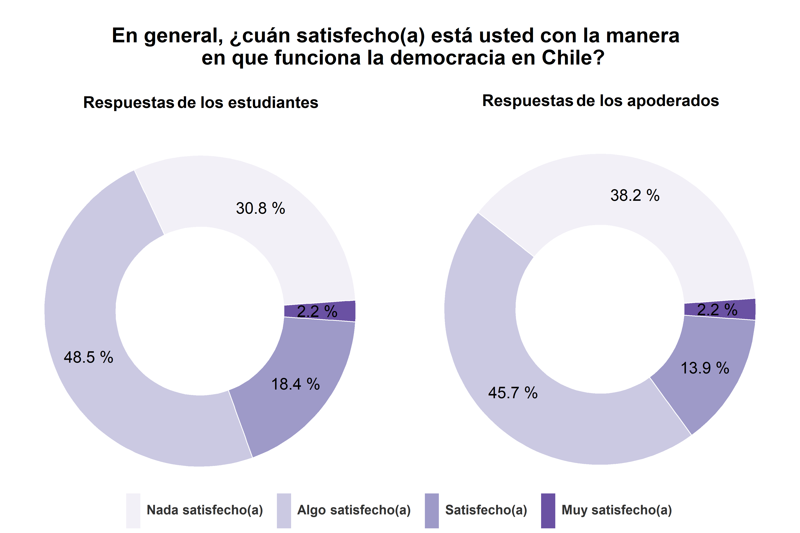

# Módulo 1: Conocimiento y formación en la escuela
## Sección 1: Conocimiento cívico

En esta sección se presentarán los resultados de una serie de preguntas que evalúan el nivel de conocimiento de los estudiantes de segundo año de enseñanza media sobre diversos temas cívicos, políticos y sociales. Las primeras seis preguntas que se presentarán provienen del Estudio Internacional de Educación Cívica y Formación Ciudadana (ICCS). Las otras ocho preguntas han sido elaboradas por el equipo de investigación para evaluar esta dimensión.  
El reporte de los resultados correspondientes a esta sección se organiza en dos subsecciones. En la primera subsección se expondrán los resultados generales de todas las preguntas sobre conocimiento cívico. En la segunda subsección se presentará un análisis de los resultados de las preguntas provenientes del estudio ICCS, comparando las respuestas de los estudiantes de 8°básico encuestados el año 2009 con las respuestas de los estudiantes de 2°medio encuestados el año 2019.

### Subsección 1: Resultados generales

Las primeras ocho interrogantes que se presentarán en esta subsección son parte de un set de preguntas que evalúa distintas aristas del <strong><i>conocimiento cívico conceptual</i></strong>. Las seis preguntas restantes evalúan diferentes dimensiones del <strong><i>conocimiento cívico factual</i></strong>.  
En relación con el patrón de respuestas cabe destacar que, en general, la mayoría de los estudiantes respondió las preguntas de forma correcta (entre un 42% y un 78.4% de los encuestados) y que, en algunas preguntas, las respuestas incorrectas se concentraron en una alternativa en particular.  

#### Pregunta n°1

Un 42% de los estudiantes respondió correctamente la pregunta. Entre las alternativas incorrectas, hubo una que distrajó a parte importante de los estudiantes, concentrando el 34% de las respuestas.

  

#### Pregunta n°2

La mayoría de los estudiantes (un 68.4%) respondió de forma correcta. Las respuestas incorrectas se concentraron en una alternativa en particular, la cual fue seleccionada por el 16.8% de los encuestados.

  

#### Pregunta n°3

La mayoría de los estudiantes (un 67.1%) seleccionó la alternativa correcta. Son pocos los estudiantes que se distrajeron con las alternativas incorrectas y la distribución de estas respuestas no se concentró en una alternativa en particular.

  

#### Pregunta n°4

La mayoría de los estudiantes (un 59.6%) respondió correctamente. Entre las alternativas incorrectas, hubo una que concentró el 25.7% de las respuestas.

  

#### Pregunta n°5

Un 49.3% de los estudiantes seleccionó la alternativa correcta. Las respuestas incorrectas se concentraron en una alternativa en particular, la cual fue seleccionada por el 25.7% de los estudiantes.

  

#### Pregunta n°6

La mayoría de los estudiantes (un 70.8%) respondió de forma correcta. Si bien son pocos los estudiantes que se distrajeron con las otras alternativas, hubo una alternativa que concentró parte importante de las respuestas incorrectas (un 15.8%).

  

#### Pregunta n°7

La mayoría de los estudiantes (un 66.4%) seleccionó la alternativa correcta. En relación con las respuestas incorrectas, una alternativa en particular concentró la mayor parte de las respuestas restantes, siendo seleccionada por el 14.3% de los estudiantes.

  

#### Pregunta n°8

La mayoría de los estudiantes (un 78.4%) respondió correctamente. Fueron pocos los que se distrajeron con las otras alternativas y las respuestas incorrectas no se concentraron en una alternativa en particular.

  

#### Pregunta n°9

Un 44.4% de los estudiantes seleccionó la alternativa correcta. Las respuestas incorrectas no se concentraron en una alternativa en particular. 

  

#### Pregunta n°10

La mayoría de los estudiantes (un 50.5%) respondió de forma correcta. Las respuestas incorrectas se concentraron en una de las alternativas, la cual fue seleccionada por el 33.2% de los estudiantes.

  

#### Pregunta n°11

La mayoría de los estudiantes (un 63.9%) respondió correctamente. Si bien fueron pocos los estudiantes que se distrajeron con las alternativas incorrectas, hubo una alternativa en particular que concentró parte importante de las respuestas restantes (un 17.1%).

  

#### Pregunta n°12

La mayoría de los estudiantes (un 69.3%) seleccionó la alternativa correcta. Las respuestas incorrectas se distribuyeron de forma pareja entre las alternativas restantes.  

  

#### Pregunta n°13

La mayoría de los estudiantes (un 53.2%) respondió de forma correcta. Las respuestas incorrectas se concentraron principalmente en dos alternativas, que fueron seleccionadas por el 21% y el 18.6% de los estudiantes.

  

#### Pregunta n°14

Un 49% de los estudiantes respondió correctamente. Casi la totalidad de respuestas restantes se concentró en una de las alternativas incorrectas (un 45.8%).

  

### Subsección 2: Comparación con el estudio ICCS 2009

Como se enuncio anteriormente, las seis preguntas que se presentarán en esta subsección corresponden a indicadores provenientes del estudio ICCS que evalúan distintas aristas del <strong><i>conocimiento cívico conceptual</i></strong>. Se comparará el patrón de respuesta de los estudiantes de 8°básico, encuestados en el estudio ICCS el año 2009, con las respuestas de los estudiantes de 2°medio, encuestados por este equipo de investigación el año 2019. Cabe destacar que la comparación se realizará con las respuestas de estudiantes de 8°básico debido a que es la única población para la cual existen datos disponibles que permiten evaluar el conocimiento cívico de estudiantes en Chile.  
En términos generales, al realizar la comparación se puede concluir que hay una tendencia al alza en la identificación de la respuesta correcta en los estudiantes de segundo medio (en 5 de las 6 preguntas) y que, en la mayoría de las preguntas, la alternativa incorrecta que concentraba más casos en las respuestas de los estudiantes de 8°básico es la misma alternativa incorrecta que concentra más casos en las respuestas de los estudiantes de 2°medio.

#### Pregunta n°1

La mayoría de los estudiantes de ambos cursos no respondió de forma correcta la pregunta. La proporción de estudiantes de 2°medio que seleccionó la alternativa correcta es mayor que la proporción de estudiantes de 8°básico que respondió correctamente (42% y 37.7%, respectivamente). Hubo una alternativa incorrecta en particular que fue un distractor importante para los estudiantes de ambos grupos, concentrando el 38.5% de las respuestas de los estudiantes de 8°básico y el 34% de las respuestas de los estudiantes de 2°medio.

  

#### Pregunta n°2

La mayoría de los estudiantes, tanto de 8°básico como de 2°medio, respondió de forma correcta. Sin embargo, la proporción de estudiantes de 2°medio que seleccionó la alternativa correcta es mayor que la proporción de estudiantes de 8°básico que respondió de forma correcta (68.4% y 58%, respectivamente). Las respuestas incorrectas de ambos grupos de estudiantes se concentraron en una alternativa en particular. Más especificamente, una de las alternativas incorrectas concentró un 24.5% de las respuestas de los estudiantes de 8°básico y un 16.8% de las respuestas de los estudiantes de 2°medio.

  

#### Pregunta n°3

La mayoría de los estudiantes de ambos grupos respondió de forma correcta, pero la proporción de estudiantes que respondió correctamente es mayor en el grupo de 2°medio que en el de 8°básico (67.1% y 54%, respectivamente). En relación con las respuestas incorrectas, cabe destacar que las respuestas de los estudiantes de 2°medio se distribuyeron de forma relativamente pareja entre las distintas alternativas, mientras que las respuestas de los estudiantes de 8°básico se concentraron en una alternativa en particular, la cual fue seleccionada por el 19.1% de los estudiantes.

  

#### Pregunta n°4

La mayoría de los estudiantes de 2°medio (un 59.6%) respondió de forma correcta, mientras que la mayoría de los estudiantes de 8°básico respondió de forma incorrecta. La alternativa que fue seleccionada por una proporción mayor de estudiantes (en ambos grupos) corresponde a la alternativa correcta. Sin embargo, la proporción de estudiantes de 8°básico que identificó la respuesta correcta es mucho menor a la proporción de estudiantes de 2°medio que respondió correctamente (39.9% y 59.6%, respectivamente). Una de las alternativas incorrectas concentró parte importante de las respuestas restantes, siendo seleccionada por el 38.1% de los estudiantes de 8°básico y por el 25.7% de los estudiantes de 2°medio.

  

#### Pregunta n°5

La mayoría de los estudiantes de ambos grupos respondió de forma incorrecta. Aunque cabe destacar que la alternativa correcta fue la que concentró una mayor proporción de respuestas (un 43.1% de los estudiantes de 8°básico y un 49.3% de los estudiantes de 2°medio seleccionaron la alternativa correcta). Las respuestas incorrectas de ambos grupos de estudiantes se concentraron en una alternativa en particular, la cual fue seleccionada por el 30.8% de los estudiantes de 8°básico y el 22.7% de los estudiantes de 2°medio. 

  

#### Pregunta n°6

La mayoría de los estudiantes seleccionó la alternativa correcta. A diferencia de las respuestas en las otras preguntas, la proporción de estudiantes de 8°básico que identificó la respuesta correcta fue mayor a la proporción de estudiantes de 2°medio que respondió correctamente. Más especificamente, un 77.3% de los estudiantes de 8°básico y un 70.8% de los estudiantes de 2°medio seleccionaron la alternativa correcta. Las respuestas incorrectas de los estudiantes de ambos grupos se concentraron en una alternativa en particular, que fue seleccionada por el 11.8% de los estudiantes de 8°básico y el 15.8% de los estudiantes de 2°medio.

  

## Sección 2: Clima democrático en el aula

En esta sección se presentarán los resultados de una serie de preguntas referidas a la formación ciudadana de los estudiantes. En el análisis de estas preguntas se compararan las respuestas de los docentes, los estudiantes y los apoderados.  

### Importancia de distintos aspectos en la formación ciudadana

La mayoría de los docentes, estudiantes y apoderados cree que el respeto y la amabilidad en las relaciones con los demás son un aspecto <i>muy importante</i> en la formación ciudadana de los estudiantes. Más específicamente, el 96.1% de los docentes, el 57% de los estudiantes y el 85.6% de los apoderados creen que es <i>muy importante</i>. En relación a las alternativas <i>nada importante</i> y <i>algo importante</i> cabe destacar que ninguno de los docentes optó por esas respuestas y que ninguno de los apoderados declaró que es un aspecto <i>nada importante</i>.

 

La mayoría de los docentes y apoderados considera que los valores democráticos son un aspecto <i>muy importante</i> en la formación ciudadana de los estudiantes. La opinión de los docentes es más homogénea que la de los estudiantes y la de los apoderados, ya que la totalidad de los profesores declaró que es un aspecto <i>importante</i> o <i>muy importante</i>. En cambio, si bien la mayor parte de los estudiantes y apoderados cree que es un aspecto <i>muy importante</i> (el 46.5% y el 71%, respectivamente), en ambos grupos algunas personas declararon que es <i>nada importante</i> o <i>algo importante</i>.

La mayoría de los docentes piensa que valorar la participación electoral es un aspecto <i>muy importante</i> en la formación ciudadana de los estudiantes. De hecho, todos los docentes declararon que es un aspecto <i>importante</i> o <i>muy importante</i>. Las opiniones de los estudiantes y apoderados fueron más variadas. Si bien la mayor parte de las respuestas de los estudiantes y de los apoderados se concentraron en las categorías <i>importante</i> (un 45.3% y un 34%, respectivamente) y <i>muy importante</i>, un 21.2% de los estudiantes y un 17.5% de los apoderados señaló que es un aspecto <i>nada importante</i> o <i>algo importante</i>.

La mayoría de los docentes, estudiantes y apoderados cree que participar de movimientos sociales no es un aspecto <i>muy importante</i> en la formación ciudadana de los estudiantes. Los docentes son quienes más valoran la importancia de este aspecto en la formación ciudadana, el 51% declaro que es <i>importante</i> y el 40.2% que es <i>muy importante</i>. La mayor parte de los estudiantes piensa que es un aspecto <i>importante</i> (un 40.6%) o <i>muy importante</i> (un 22.2%), pero hay un gran grupo de estudiantes que cree que es un aspecto <i>algo importante</i> (29.2%) o <i>nada importante</i> (un 8%). La mayor parte de los apoderados cree que es un aspecto <i>algo importante</i> (un 31.2%) o <i>nada importante</i> (un 29.8%), pero hay un gran grupo de apoderados que piensa que es <i>importante</i> (un 18.4%) o <i>muy importante</i> (un 20.7%).

La mayoría de los docentes y apoderados piensa que el cumplimiento de la ley es un aspecto <i>muy importante</i> en la formación ciudadana de los estudiantes (un 64.7% y un 67.2%, respectivamente). La mayor parte de las respuestas de los estudiantes se concentró en las alternativas <i>importante</i> (un 48.1%) y <i>muy importante</i> (un 38%). Las respuestas restantes de los docentes y apoderados se concentran en la alternativa <i>importante</i> (un 33.3% y un 25.7%, respectivamente). 

Las respuestas de los estudiantes y apoderados son bastante similares. La mayoría de las personas de ambos grupos cree que el aspecto que debería ser más importante en la formación ciudadana es el respeto y la amabilidad en las relaciones con los demás (opción seleccionada por el 60.2% de los estudiantes y el 68.8% de los apoderados). Este aspecto también fue destacado por un gran grupo de docentes (un 33.7%), pero la mayoría de los docentes declaro que el aspecto que debería ser más importante en la formación ciudadana corresponde a los valores democráticos (el 53.7%). 

### Quién juega el rol más importante en distintos aspectos de la formación ciudadana

# Módulo 2: Actitudes políticas

## Sección 1: Actitudes hacia la democracia

## Sección 2: Creencias y actitudes autoritarias

## Sección 3: Confianza en instituciones

# Módulo 3: Participación
## Sección 1: Participación formal

## Sección 2: Participación activista

## Sección 3: Participación comunitaria

