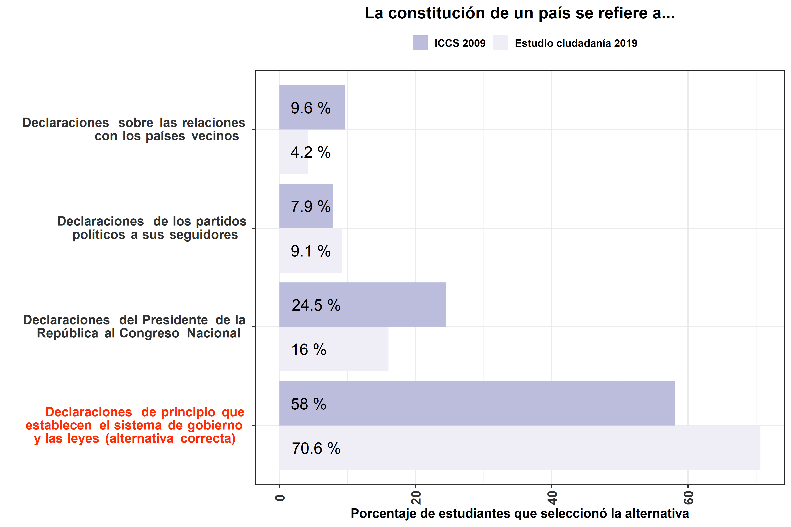
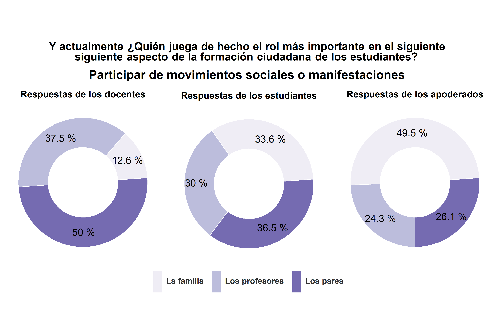
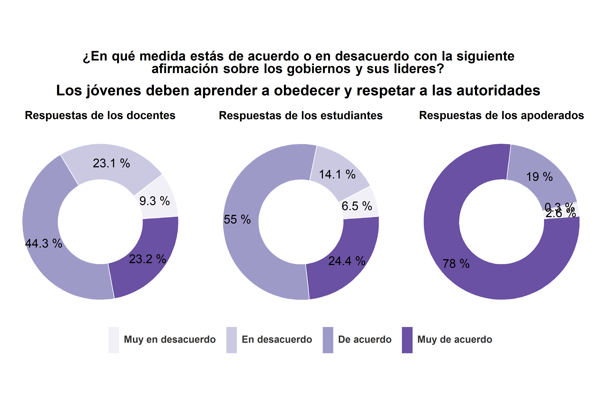
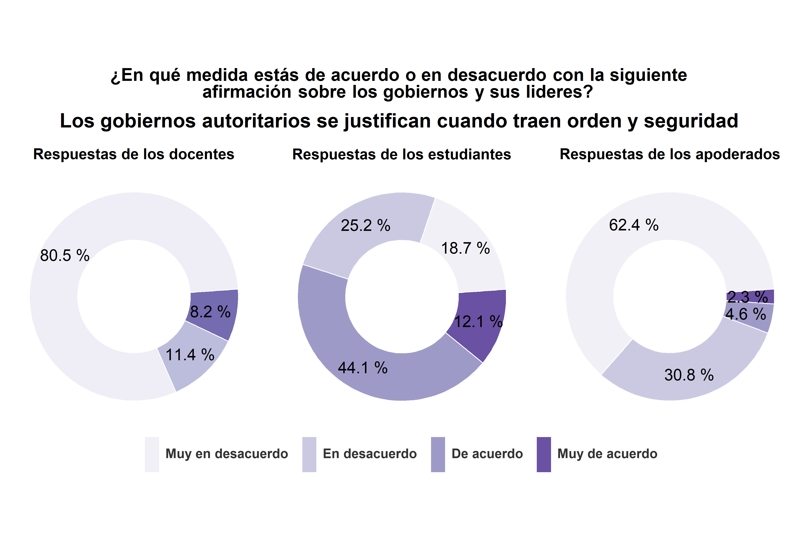
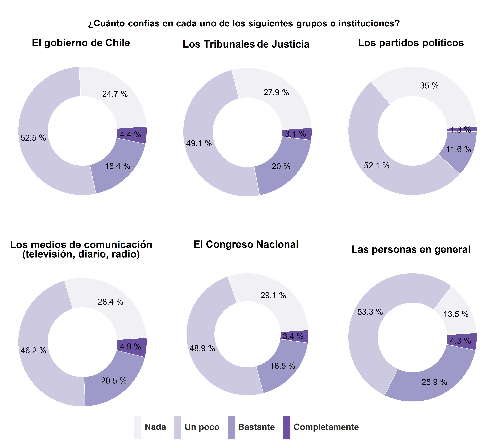
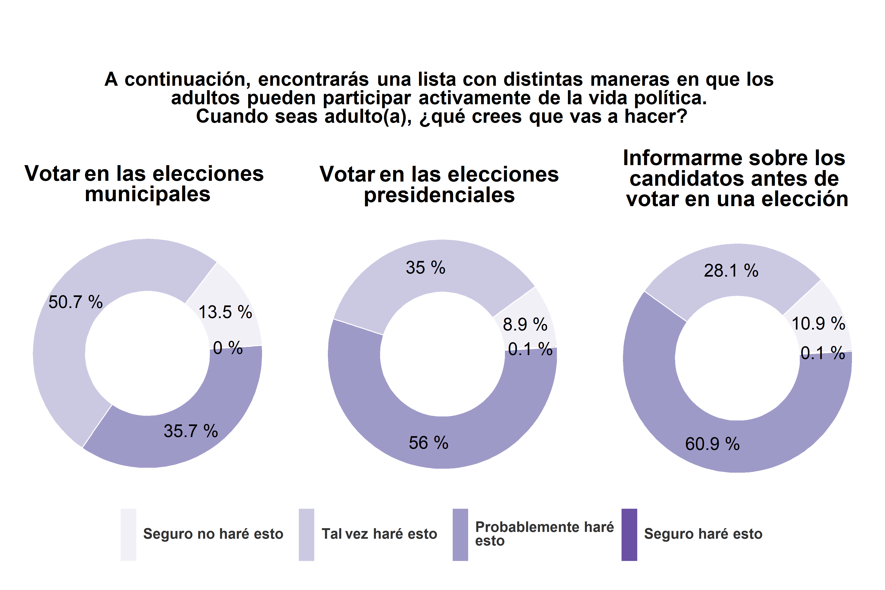

# Módulo 1: Conocimiento y formación en la escuela
## Sección 1: Conocimiento cívico

En esta sección se presentarán los resultados de una serie de preguntas que evalúan el nivel de conocimiento sobre diversos temas cívicos, políticos y sociales de los estudiantes de segundo año de enseñanza media. Las primeras seis preguntas que se presentarán provienen del Estudio Internacional de Educación Cívica y Formación Ciudadana (ICCS). Las otras ocho preguntas han sido elaboradas por el equipo de investigación para evaluar esta dimensión.  
El reporte de los resultados correspondientes a esta sección se organiza en dos subsecciones. En la primera subsección se expondrán los resultados generales de todas las preguntas sobre conocimiento cívico. En la segunda subsección se presentará un análisis de los resultados de las preguntas provenientes del estudio ICCS, comparando las respuestas de los estudiantes de 8°básico encuestados el año 2009 con las respuestas de los estudiantes de 2°medio encuestados el año 2019.

### Subsección 1: Resultados generales

Las primeras ocho interrogantes que se presentarán en esta sección son parte de un set de preguntas que evalúa distintas aristas del <strong><i>conocimiento cívico conceptual</i></strong>. Las seis preguntas restantes evalúan diferentes dimensiones del <strong><i>conocimiento cívico factual</i></strong>.  
En relación con el patrón de respuestas, cabe destacar que en general la mayoría de los estudiantes respondió las preguntas de forma correcta (entre un 42% y un 78.4% de los encuestados) y que, en algunas preguntas, las respuestas incorrectas se concentraron en una alternativa en particular.  

#### Pregunta n°1

Un 42% de los estudiantes respondió correctamente la pregunta. Entre las alternativas incorrectas, hubo una que distrajó a parte importante de los estudiantes, concentrando el 34% de las respuestas.

  

#### Pregunta n°2

La mayoría de los estudiantes (un 68.4%) respondió de forma correcta. Las respuestas incorrectas se concentraron en una alternativa en particular, la cual fue seleccionada por el 16.8% de los encuestados.

  

#### Pregunta n°3

La mayoría de los estudiantes (un 67.1%) seleccionó la alternativa correcta. Son pocos los estudiantes que se distrajeron con las alternativas incorrectas y la distribución de estas respuestas no se concentró en una alternativa en particular.

  

#### Pregunta n°4

La mayoría de los estudiantes (un 59.6%) respondió correctamente. Entre las alternativas incorrectas, hubo una que distrajó a parte importante de los estudiantes, concentrando el 25.7% de las respuestas.

  

#### Pregunta n°5

Un 49.3% de los estudiantes seleccionó la alternativa correcta. Las respuestas incorrectas se concentraron en una alternativa en particular, la cual fue seleccionada por el 25.7% de los estudiantes.

  

#### Pregunta n°6

La mayoría de los estudiantes (un 70.8%) respondió de forma correcta. Si bien son pocos los estudiantes que se distrajeron con las otras alternativas, hubo una alternativa que concentró parte importante de las respuestas incorrectas (un 15.8%).

  

#### Pregunta n°7

La mayoría de los estudiantes (un 66.4%) seleccionó la alternativa correcta. En relación con las respuestas incorrectas, hubo una alternativa en particular que concentró la mayor parte de las respuestas restantes, siendo seleccionada por un 14.3% de los estudiantes.

  

#### Pregunta n°8

La mayoría de los estudiantes (un 78.4%) respondió correctamente. Fueron pocos los que se distrajeron con las otras alternativas y las respuestas incorrectas no se concentraron en una alternativa en particular.

  

#### Pregunta n°9

Un 44.4% de los estudiantes seleccionó la alternativa correcta. Las respuestas incorrectas no se concentraron en una alternativa en particular. 

  

#### Pregunta n°10

La mayoría de los estudiantes (un 50.5%) respondió de forma correcta. Las respuestas incorrectas se concentraron en una de las alternativas, la cual fue seleccionada por el 33.2% de los estudiantes.

  

#### Pregunta n°11

La mayoría de los estudiantes (un 63.9%) respondió correctamente. Si bien fueron pocos los estudiantes que se distrajeron con las alternativas incorrectas, hubo una alternativa en particular que concentró parte importante de las respuestas restantes (un 17.1%).

  

#### Pregunta n°12

La mayoría de los estudiantes (un 69.3%) seleccionó la alternativa correcta. Las respuestas incorrectas se distribuyeron de forma pareja entre las alternativas restantes.  

  

#### Pregunta n°13

La mayoría de los estudiantes (un 53.2%) respondió de forma correcta. Las respuestas incorrectas se concentraron principalmente en dos alternativas, que fueron seleccionadas por el 21% y el 18.6% de los estudiantes.

  

#### Pregunta n°14

Un 49% de los estudiantes respondió correctamente. Casi la totalidad de respuestas restantes se concentró en una de las alternativas incorrectas (un 45.8%).

  

### Subsección 2: Comparación con el estudio ICCS 2009

### Cruces

## Sección 2: Clima democrático en el aula

# Módulo 1: Actitudes políticas

## Sección 1: Actitudes hacia la democracia

## Sección 2: Creencias y actitudes autoritarias

## Sección 3: Confianza en instituciones

# Módulo 3: Participación 
## Sección 1: Participación formal

## Sección 2: Participación activista

## Sección 3: Participación comunitaria

