# Conocimiento y formación en la escuela
## Conocimiento cívico
### Resultados generales

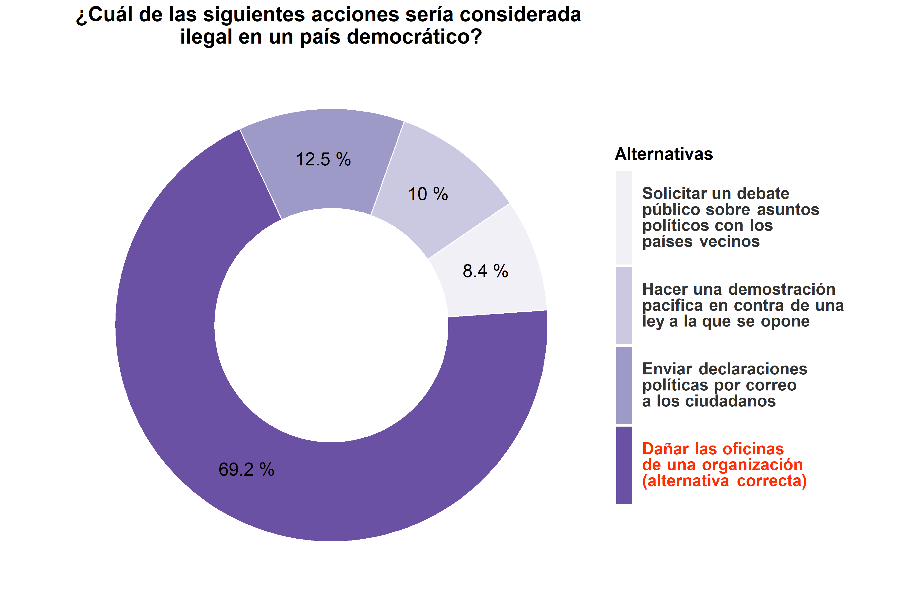

### Comparación con el estudio ICCS 2009

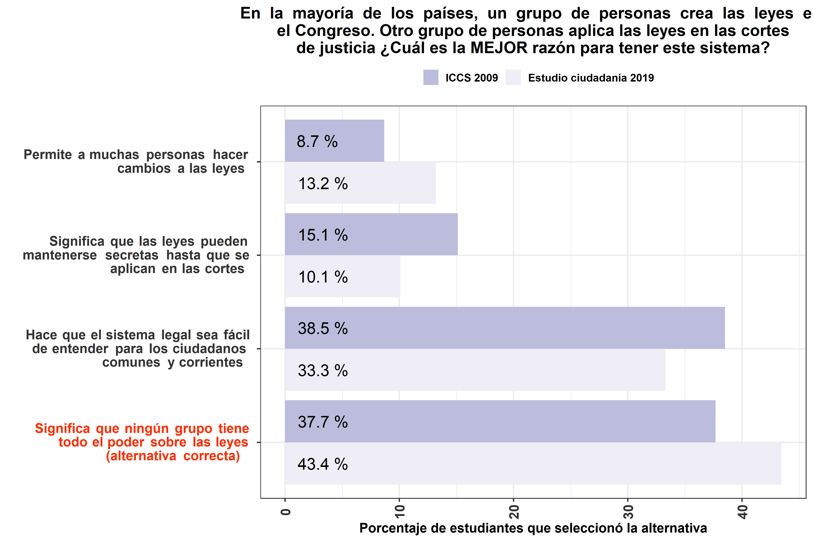

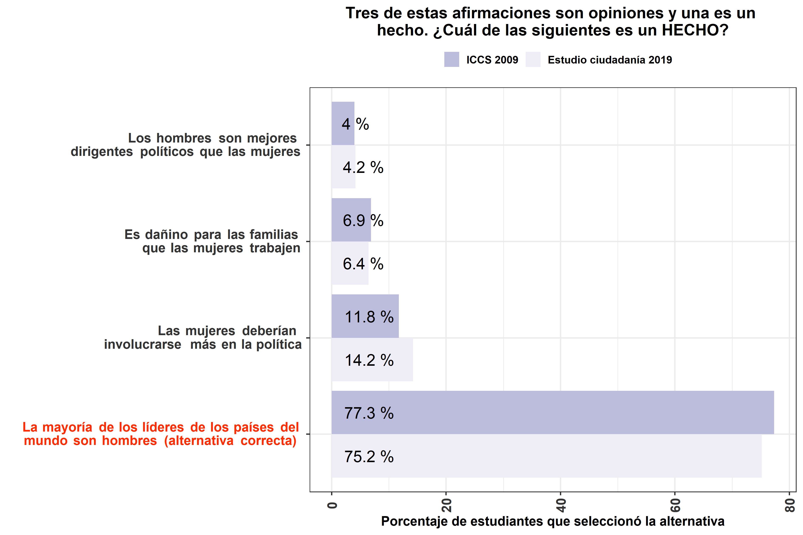

### Cruces
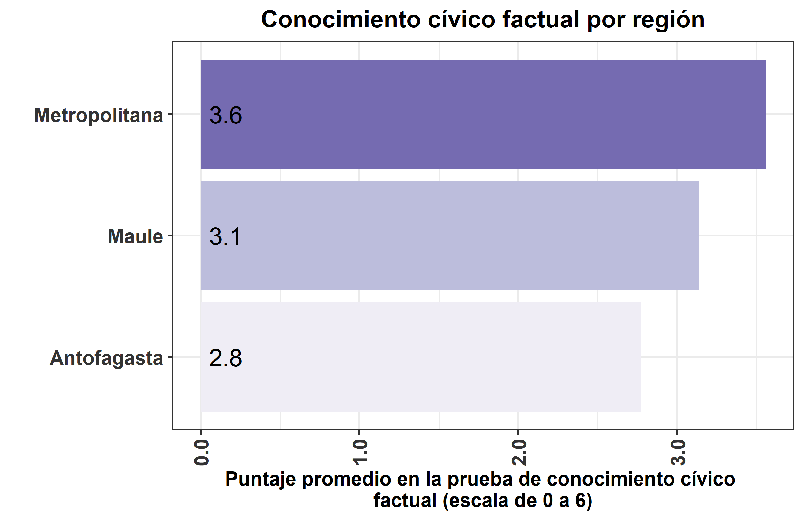

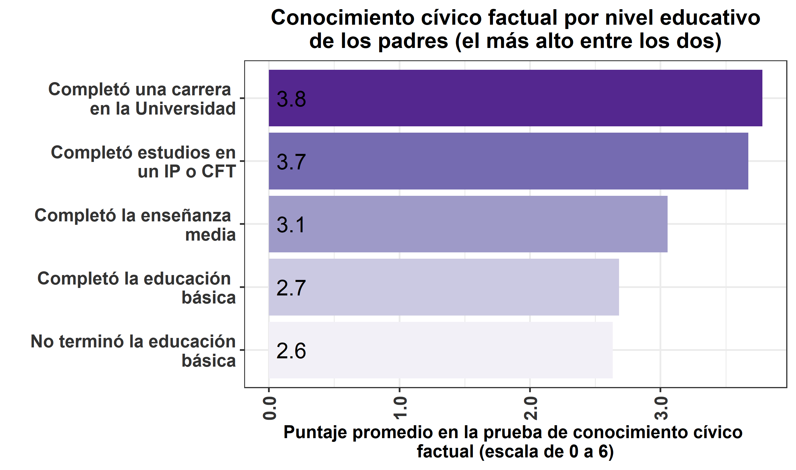

## Clima democrático en el aula
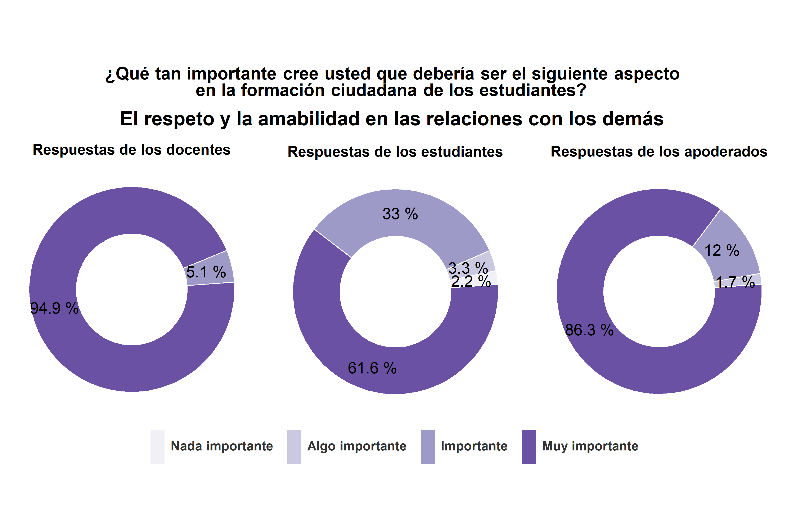

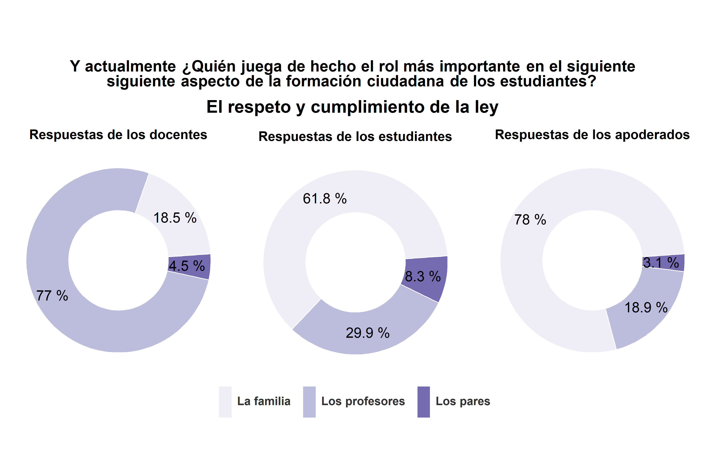

# Actitudes políticas
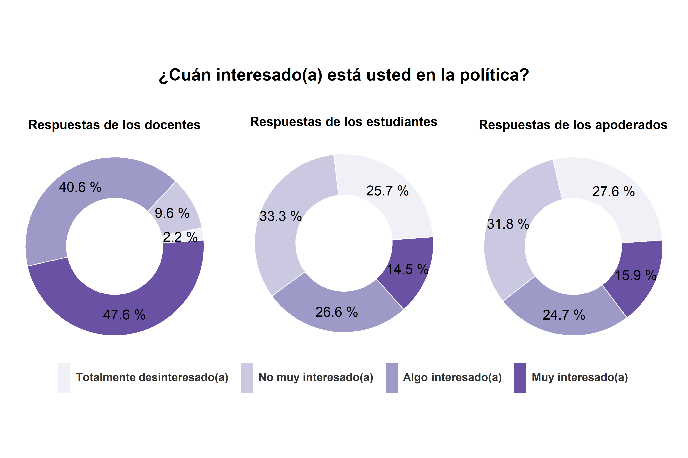

## Actitudes hacia la democracia

## Creencias y actitudes autoritarias

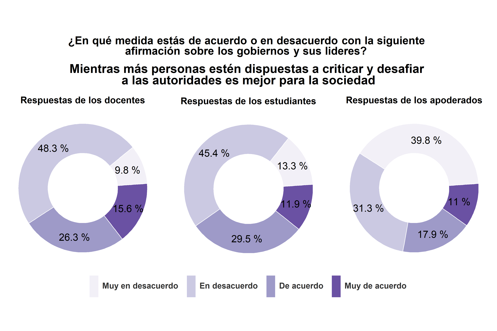

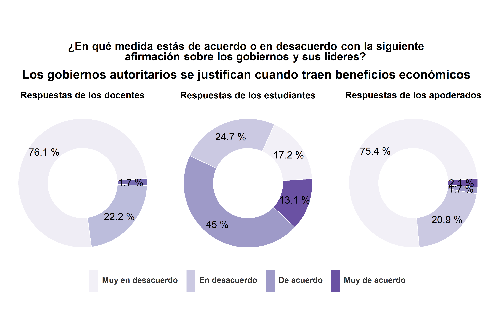

## Confianza en instituciones

# Participación 
## Participación formal

## Participación activista

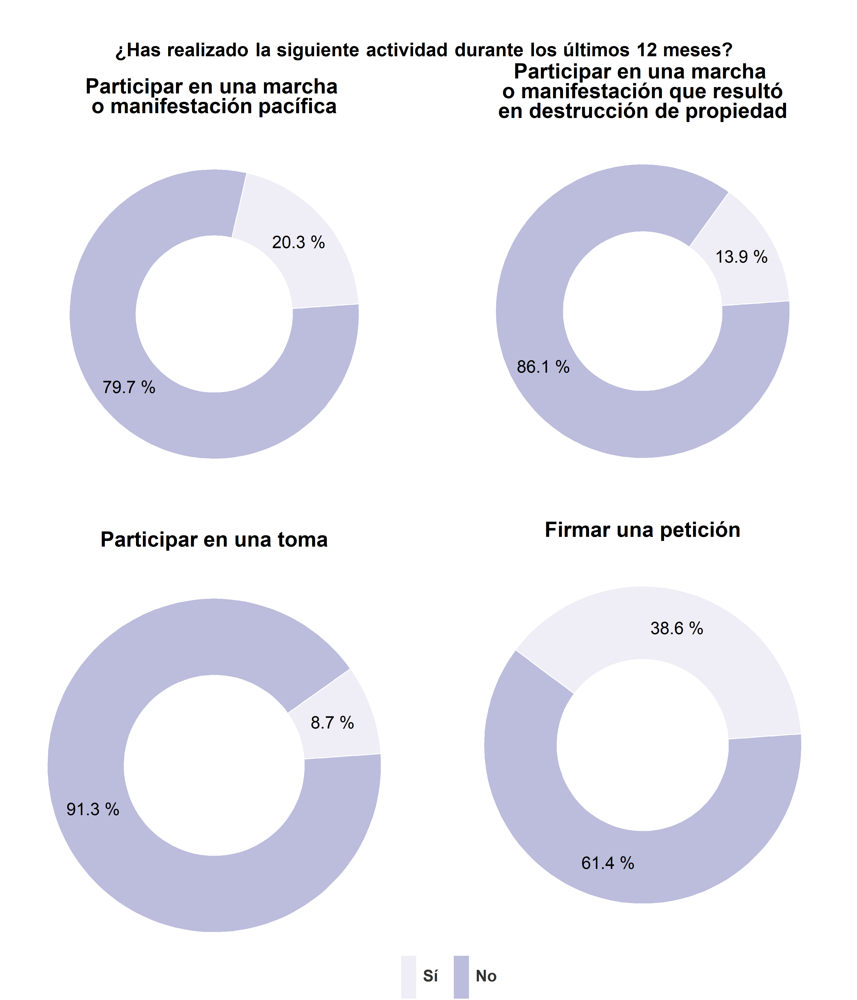

## Participación comunitaria

